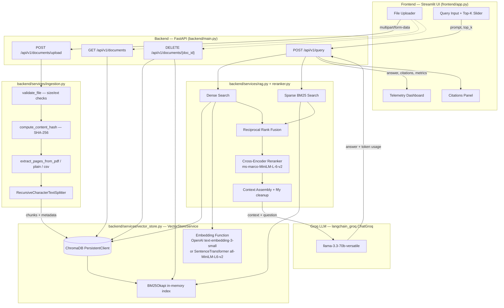

# ARCHITECTURE.md
## Intelligent Document Understanding & Retrieval Engine — System Design & Trade-offs

---

## 1. System Architecture Diagram

**Request-flow summary:**
1. **Ingestion path:** Streamlit → FastAPI `/documents/upload` → `ingestion.py` (validate → hash → extract → chunk) → `vector_store.py` (embed → persist to ChromaDB → rebuild BM25).
2. **Query path:** Streamlit → FastAPI `/query` → parallel dense (ChromaDB) + sparse (BM25) retrieval → RRF fusion → cross-encoder re-rank → context assembly → Groq LLM → structured response with citations and per-stage latency telemetry back to the UI.

---

## 2. Component Breakdown

### `backend/main.py`
The FastAPI application entrypoint. Declares CORS middleware (open to all origins), the allowed-extension allow-list, and all four REST endpoints (`upload`, `query`, `list`, `delete`) directly, using the shared Pydantic schemas from `backend/models/schemas.py`. This file also independently re-implements the upload validation and duplicate-hash logic seen in `backend/api/routes/documents.py` — both code paths exist in the repository, with `main.py` registering routes directly on the `app` object rather than including the `APIRouter` instances from `backend/api/routes/`.

### `backend/config.py`
Centralized configuration via Pydantic `BaseSettings`, loading from `.env`. Owns every tunable constant in the system: file size/extension limits, chunking hyperparameters, hybrid-search toggles, reranker model name, Groq model name, and the nominal embedding model string. All services import the single `settings` singleton rather than reading environment variables ad hoc (with the exception of `vector_store.py`, which reads `OPENAI_API_KEY` directly via `os.getenv` to decide embedding backend).

### `backend/api/routes/documents.py` & `backend/api/routes/query.py`
`APIRouter`-based modules mirroring the upload/list/delete and query logic found in `main.py`. They import `vector_store_service` and `rag_service` and expose the same contracts under `/documents` and `/query` prefixes, intended for modular inclusion into the FastAPI app.

### `backend/models/schemas.py`
The single source of truth for all request/response Pydantic models: `DocumentMetadata`, `UploadResponse`, `Citation`, `QueryRequest`, `LatencyBreakdown`, `ExecutionMetrics`, `QueryResponse`, and `ErrorResponse`. Centralizing schemas here ensures the API contract is consistent regardless of which route module handles a given request.

### `backend/services/ingestion.py`
Pure document-processing logic, decoupled from FastAPI/ChromaDB concerns (raises `HTTPException` directly for validation failures, which is the one FastAPI-coupling point). Responsibilities:
- `validate_file`: size and extension gatekeeping.
- `compute_content_hash`: SHA-256 over raw bytes, used for deduplication.
- `extract_pages_from_pdf`: per-page text extraction via `pypdf`, skipping blank pages.
- `extract_text_from_plain_file`: multi-encoding decode for `.txt`/`.md`.
- `process_csv_file`: `csv.DictReader`-based row extraction, formatting each row as `col: val | col: val`.
- `process_and_chunk_document`: the orchestration entrypoint — dispatches by extension, applies `RecursiveCharacterTextSplitter` for text formats (row-based chunking for CSV bypasses the splitter entirely), and attaches per-chunk metadata (`doc_id`, `content_hash`, `chunk_id`, `page_number`/`row_number`, `total_pages`, `file_type`).

### `backend/services/vector_store.py`
`VectorStoreService` — the single stateful component owning both the dense and sparse indices:
- Initializes a `chromadb.PersistentClient` against `CHROMA_DB_DIR`, with `hnsw:space: cosine` set explicitly on the collection.
- Selects an embedding function at construction time: OpenAI `text-embedding-3-small` if `OPENAI_API_KEY` is present, else a local `SentenceTransformerEmbeddingFunction` (`all-MiniLM-L6-v2`).
- Maintains a parallel **in-memory BM25Okapi index**, rebuilt in full from the ChromaDB collection contents on every `add_documents` and `delete_document_by_id` call (`_rebuild_bm25_index`).
- Exposes `search_similar_chunks` (dense, with per-call embedding and I/O latency instrumentation), `search_bm25` (sparse, with latency instrumentation), `delete_document_by_id`, `find_document_by_hash` (used for dedup, checks metadata filter first and falls back to a full metadata scan), and `list_indexed_documents` (aggregates chunk-level metadata into per-document summaries in Python, since ChromaDB has no native "distinct document" query).
- Instantiated once as a module-level singleton (`vector_store_service`), imported by every consumer.

### `backend/services/reranker.py`
`RerankerService` — two independent retrieval-quality mechanisms:
- `reciprocal_rank_fusion`: merges dense and sparse candidate lists using the standard RRF formula `score = Σ 1 / (k + rank)` with `k=60`, keyed by `chunk_id` (falling back to raw chunk text if `chunk_id` metadata is absent).
- `rerank_chunks`: loads a `sentence_transformers.CrossEncoder` (`cross-encoder/ms-marco-MiniLM-L-6-v2`) at service construction, scores every `(query, chunk_text)` pair, and applies **min-max normalization** across the current candidate batch to produce a `relevance_score` in `[0, 1]`, alongside the untouched `raw_logit`. Falls back to a flat `0.5` score for all candidates if the cross-encoder failed to load (e.g., no network access to download weights).
- Instantiated once as a module-level singleton (`reranker_service`), loaded eagerly at import time (i.e., at process startup, not lazily on first query).

### `backend/services/rag.py`
`RAGService` — orchestrates the full retrieval-augmented generation pipeline and owns all latency/cost instrumentation:
- Builds a `ChatPromptTemplate` around a fixed `SYSTEM_PROMPT` that constrains the LLM to context-only answers and mandates the `[File: ..., Page/Row: ...]` citation format.
- `generate_rag_response`: runs dense retrieval → (conditionally) sparse retrieval + RRF fusion → (conditionally) cross-encoder re-ranking → context assembly (with `ftfy`-based mojibake cleanup) → LLM invocation via LangChain's `ChatGroq`, extracting token usage from either `usage_metadata` or `response_metadata` depending on what the underlying LangChain response object populates.
- Computes `estimated_cost_usd` using hardcoded per-million-token rates (`$0.59` prompt / `$0.79` completion).
- Degrades gracefully at two failure points: no `GROQ_API_KEY` → retrieval-only response; LLM invocation exception → error string is returned as the "answer" rather than raising.
- Exposed via a thread-safe lazy singleton (`get_rag_service()`), distinct from the reranker's eager singleton — this defers Groq client construction (and therefore any API-key validation) until the first query is received. Note that `backend/api/routes/query.py` imports a directly-instantiated `rag_service` object instead of calling `get_rag_service()`, meaning the two route registrations in this codebase (`main.py` vs. `api/routes/`) use slightly different instantiation paths for the same underlying class.

### `frontend/app.py`
A single-file Streamlit application acting purely as an HTTP client against `http://localhost:8000/api/v1` (no direct imports from `backend/`). Provides: a sidebar file uploader and "Index Document" action, a live-refreshed list of indexed documents with per-document delete buttons, a main query panel with an adjustable Top-K slider, a full telemetry dashboard rendering every field of `ExecutionMetrics` (including the granular per-stage `retrieval_breakdown`), and a citations panel with color-coded confidence badges (Green ≥75%, Amber ≥50%, Red <50%) derived from `relevance_score`.

### `tests/`
`tests/test_ingestion.py` uses `fastapi.testclient.TestClient` against the live `backend.main.app` (exercising the real `main.py` upload route and the real ChromaDB/BM25 state, with fixture-based cleanup before/after each test) to verify SHA-256 duplicate-replacement semantics and same-filename/different-content coexistence. `tests/test_reranker_normalization.py` targets a `logit_to_confidence_percentage` sigmoid-normalization function imported from `backend.services.reranker`.

---

## 3. Technical Design Decisions & Trade-offs

### 3.1 Why ChromaDB
The implementation selects ChromaDB's `PersistentClient` (local, file-backed) over a managed or server-based vector database:
- **Persistence without infrastructure.** `PersistentClient(path=CHROMA_DB_DIR)` durably writes the HNSW index and SQLite metadata store to local disk (`chroma_db/`), giving restart-safe persistence with zero external services to provision — appropriate for a single-node, evaluator-run platform.
- **Native metadata filtering.** `collection.get(where={"doc_id": doc_id})` and `where={"content_hash": ...}` are used directly for deletion and deduplication lookups, avoiding a separate metadata store or join logic.
- **Pluggable embedding functions.** ChromaDB's `embedding_functions` abstraction is what allows the codebase to swap between OpenAI and local SentenceTransformer embeddings behind a single interface (`self.embedding_fn`), rather than hand-rolling embedding calls and storage.
- **Trade-off accepted:** a single local `PersistentClient` does not horizontally scale and has no built-in multi-writer concurrency guarantees — acceptable for the demonstrated single-process FastAPI + Streamlit deployment, but a constraint worth flagging for any multi-instance deployment.

### 3.2 Why This Chunk Size & Overlap Strategy
`CHUNK_SIZE=1000`, `CHUNK_OVERLAP=200` (20% overlap), applied via LangChain's `RecursiveCharacterTextSplitter`:
- **Semantic continuity vs. embedding fidelity.** A 1000-character window is small enough to keep each chunk's embedding representative of a single, coherent idea (avoiding the "topic dilution" that occurs with very large chunks), while remaining large enough to preserve surrounding sentence context that a naive fixed-width or sentence-only splitter would fragment.
- **200-character overlap** ensures that content spanning a chunk boundary (e.g., a sentence or clause split mid-window) still appears in full in at least one adjacent chunk, reducing the chance that a relevant fact is only ever partially indexed.
- **Recursive splitting** (rather than a hard character cut) respects natural text boundaries (paragraphs → sentences → words) where possible, which the `RecursiveCharacterTextSplitter`'s separator hierarchy provides by default.
- **CSV is deliberately excluded from this strategy.** Row-based chunking (one row = one chunk) is used instead, because character-based splitting would arbitrarily fragment structured `column: value` records and destroy row-level retrievability — the design correctly treats CSV as structured data rather than prose.
- **Trade-off accepted:** a fixed chunk size does not adapt to document structure (e.g., headings, tables within PDFs) — every document, regardless of internal structure, is chunked identically by character count.

### 3.3 Why This Distance Metric / Search Strategy
- **Cosine distance** is set explicitly on the ChromaDB collection (`metadata={"hnsw:space": "cosine"}`), the standard choice for normalized sentence-embedding spaces (both OpenAI's `text-embedding-3-small` and `all-MiniLM-L6-v2` are optimized for cosine similarity), since it measures semantic direction rather than embedding magnitude.
- **Hybrid dense + sparse retrieval** is used rather than dense-only search: BM25 (`rank_bm25.BM25Okapi`) captures exact keyword/lexical matches (identifiers, numbers, proper nouns) that dense embeddings can under-weight, while dense retrieval captures semantic paraphrase matches that BM25 cannot. Both retrieve a wider candidate pool (`DENSE_TOP_K=10`, `SPARSE_TOP_K=10`) than the final `top_k`, giving the fusion/re-ranking stages real signal to work with rather than operating on an already-truncated set.
- **Reciprocal Rank Fusion (`k=60`)** is used to merge the two ranked lists without requiring score-scale normalization between BM25 scores and cosine distances (which are not directly comparable) — RRF only needs each list's *rank order*, making it a robust, tuning-free fusion strategy.
- **Cross-encoder re-ranking as a final precision pass.** RRF produces a good candidate set but is still based on independently-computed dense/sparse relevance; a cross-encoder (`ms-marco-MiniLM-L-6-v2`) jointly encodes `(query, chunk)` pairs, giving a materially more accurate relevance judgment at the cost of being too slow to run over the entire corpus — hence its use only on the already-fused, size-bounded candidate set rather than as a first-pass retriever.
- **Trade-off accepted:** three sequential retrieval/scoring stages (dense, sparse, cross-encoder) increase per-query latency compared to dense-only search; the platform's own telemetry (`LatencyBreakdown`) is itself evidence that this trade-off was made deliberately and is being actively measured rather than assumed.

### 3.4 Source Traceability & Page Citations in Prompt Engineering
- Every chunk's metadata carries either `page_number` (PDF/TXT/MD) or `row_number` (CSV), attached at ingestion time and never recomputed — traceability is established once, at the source, rather than inferred at query time.
- At query time, `rag.py` assembles each retrieved chunk into a labeled block: `[File: {file_name}, Page: {page_number}]` or `[File: {file_name}, Row: {row_number}]`, joined with `---` separators, before it ever reaches the LLM.
- The `SYSTEM_PROMPT` explicitly instructs the model to **only** answer from the supplied context, to respond with a fixed fallback string (`"No relevant context found in documents."`) when context is insufficient, and to cite using exactly the `[File: ..., Page/Row: ...]` format shown in the context — i.e., the citation format is taught to the model by example in the same message that supplies the context, rather than via a separate instruction the model must generalize from scratch.
- Independently of what the LLM outputs, the API response's `citations` array is built directly from retrieval metadata (not parsed out of the LLM's free-text answer), so citation accuracy for the structured `Citation` objects does not depend on the LLM correctly following the in-text citation instruction — the UI's "Sources & Citations" panel is authoritative regardless of prose quality.

### 3.5 Robustness & State Management During Document Removal/Purging
- **Atomic-per-document deletion.** `delete_document_by_id` issues a single `collection.delete(where={"doc_id": doc_id})` call, removing every chunk belonging to that document in one operation rather than iterating chunk-by-chunk, avoiding partial-delete states.
- **Existence check before delete.** The method first performs a `collection.get(where={"doc_id": doc_id})` and returns `False` (surfaced as `HTTP 404`) if nothing matches, rather than issuing a no-op delete and reporting success — callers can distinguish "already gone" from "deleted."
- **Sparse-index consistency.** Because BM25Okapi has no incremental delete API, `_rebuild_bm25_index()` is called after every deletion (and every addition), fully reconstructing the sparse index from the current ChromaDB contents. This guarantees the dense and sparse indices are never out of sync with each other, at the cost of an O(corpus size) rebuild on every mutation.
- **Duplicate replacement is delete-then-insert, not update-in-place.** On a hash-matching re-upload, `main.py` explicitly deletes the existing document's vectors before the new chunks are indexed — this means a new `doc_id` is minted for what is semantically "the same" document, which is reflected and explicitly asserted in `tests/test_ingestion.py`.